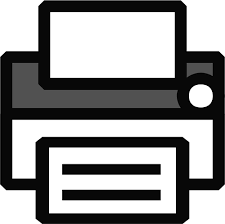
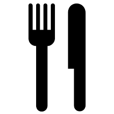

# Semiotik

Semiotik är läran om teckens mening, och grundlades parallellt av Charles Sanders Pierce och Ferdinand de Saussure. Saussure kallade det då för semiologi snarare än semiotik, men idag använder vi det senare. (Semiotik, 2017)

En kort kommentar om källor innan vi går vidare - jag använder mig av wikipedia i denna text, trots att jag egentligen förordar att man ska undvika tertiära källor som denna. Men detta är så pass grundläggande inom semiotiken, att det inte finns någon större aledning att tro att informationen kommer att ändras nämvärt. Jag ämnar vid tillfälle att arbeta om texten med bättre källor. 

Saussure menade att en tecken består av två delar: Det betecknande som bär betydelse, och det betecknade som det koncept som det betecknande refererar till (Ferdinand de Saussure, 2017). Han menar att relationen mellan dessa är arbiträr, eller godtycklig. Exempelvis har vi det språkliga tecknet "träd" som står för en företeelse i världen som vi alla känner till. Det ljudliga tecknet för detta - det vill säga om jag säger ordet träd - är ett tecken för samma sak. 

Pierce semiotik är den vi ska fokusera mer på i denna kurs, och den en komplex lära om man börjar gräva i den. För den här kursens syfte räcker det dock med en ganska enkel modell. 

## Pierce kategorier

Pierce menade att visuella teckens relation till det de betecknar kan delar in i tre olika kategorier: Ikon, Index och Symbol (Semiotic theory of Charles Sanders Peirce, 2017; Commens, n.d.). Ikon är den närmaste relationen mellan tecken och betecknat, där tecknet är en direkt avbild. Index är den relation där det finns en logisk koppling - betydelsen går att lista ut trots att det inte är en direkt avbild. Symbol är den svagaste kopplingen, och måste läras. 

 Ikon är alltså en direkt avbild - till exempel så används en bild på en skrivare i många gränssnitt för att signalera att här kan du skicka ditt dokument till skrivaren. Detta är en ikonisk relation då bilden du ser är det som menas med den. 

 En indexikal relation mellan tecken och betecknat är då tecknet pekar på, eller har en logisk relation till det betecknade. En kniv och en gaffel kan vi tolka som ett index då det används som tecken för restaurang. Det är inte kniven och gaffeln som är budskapet med bilden - om du åker förbi en skylt som denna på en väg ute i landet så ska du inte tänka "Åh, här kan jag köpa knivar och gafflar!" utan "Åh, här finns mat!" 

 En symbolisk relation mellan tecken och betecknat är som sagt den svagaste, där relationen helt och hållet bygger på en social överenskommelse. Språket i sig är i grunden symboliskt, då vi måste lära oss vad respektive ord står för i grunden - det går inte att gissa sig till utan att ha några ord att utgå ifrån. Symbolen för biologisk fara är likaså en symbol - du kan inte förstå vad den syftar till utan att lära dig detta. 

## I praktiken

Vad betyder då detta i praktiken? Det kan framför allt ha betydelse när vi väljer bildspråk både vad gäller ikoner som signalerar funktionalitet (det är i dessa sammanhang lite olyckligt att vi har samma termer i vardagen som i semiotiken), och bilder som signalerar mer komplexa budskap. Som regel kan sägas att ju mer ikonisk relationen mellan en bild och det bilden signalerar, desto lättare är det för en användare att förstå. Symboler som är väl inarbetade fungerar väldigt bra, men man måste vara vaksam på att det kan finnas stora kulturella skillnader i tolkning av symboler och index (även till viss del ikoner!), och det är svårt att se utanför sin egen kulturella kontext och förutsäga dessa olikheter.

Många tecken började som ikoner, men har blivit mer indexikala eller till och mer symboliska för att världen förändras. Ta till exempel tecknet för att spara ett dokument i de flesta program - det vanligaste tecknet är en bild på en floppy disk. I grunden var detta ett självklart, ikoniskt val - men nuförtiden används inte dessa disketter, och många (i alla fall som inte är väldigt tekniskt intresserade) har aldrig ens använt en diskett i verkliga livet. 

## Läs mer

Harnessing the Power of Semiotics in UX Design: https://blogs.adobe.com/creativecloud/harnessing-the-power-of-semiotics-in-ux-design/

Explaining semiotics - Infographic: https://www.behance.net/gallery/9474813/Explaining-Semiotics-Infographic

## Källor
Ferdinand de Saussure. (2017, October 12). In Wikipedia, The Free Encyclopedia. Retrieved 09:52, November 7, 2017, from https://en.wikipedia.org/w/index.php?title=Ferdinand_de_Saussure&oldid=805001950

Semiotic theory of Charles Sanders Peirce. (2017, October 30). In Wikipedia, The Free Encyclopedia. Retrieved 09:50, November 7, 2017, from https://en.wikipedia.org/w/index.php?title=Semiotic_theory_of_Charles_Sanders_Peirce&oldid=807820552

Semiotics. (2017, October 11). In Wikipedia, The Free Encyclopedia. Retrieved 09:52, November 7, 2017, from https://en.wikipedia.org/w/index.php?title=Semiotics&oldid=804784103

Commens - Digital Companion to C. S. Peirce. Retrieved November 07, 2017, from http://www.commens.org/dictionary/term/index